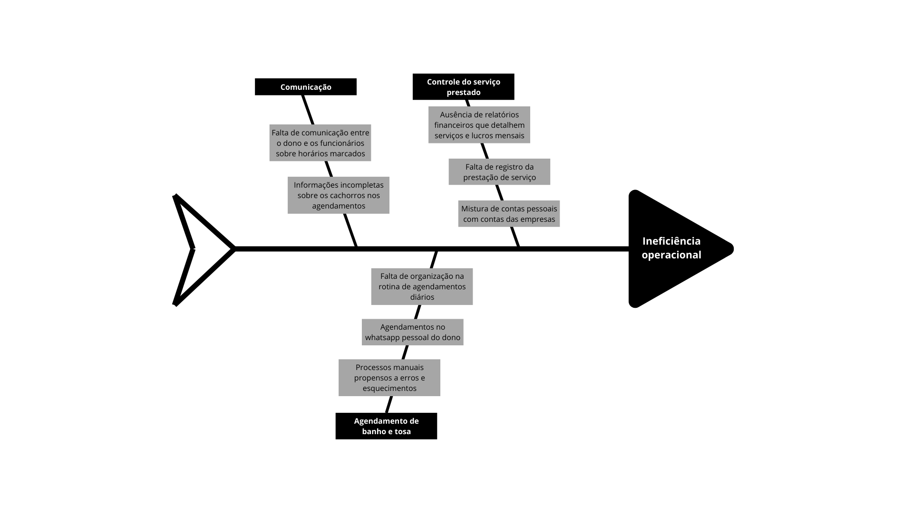

# Cenário Atual do Cliente e do Negócio

##  Introdução ao negócio e contexto

O Pet Shop Guará é um pet shop que tem como sua prioridade atender a população do Guará, onde está localizado. Como é considerado uma empresa de pequeno porte, Tiago, dono do empreendimento e nosso cliente, optou por priorizar um único serviço, o de banho e tosa, sendo esse a principal fonte de renda e procura de seus clientes. Tiago conta com 2 funcionários em sua empresa, que são responsáveis principalmente para realizarem o banho e a tosa dos cachorros. Por mais que esse serviço seja o mais rentável para a empresa, ele não é o único oferecido, já que a vendas de itens do mercado pet também é realizado, como rações, tapetes higiênicos, coleiras etc. 

## Identificação da Oportunidade ou Problema

O cliente enfrenta desafios significativos com os agendamentos e controle financeiro, essenciais para o serviço de banho e tosa. Seu principal problema é a ineficiência operacional do seu negócio, com dois grandes catalisadores: gestão de agendamentos e controle de vendas. Os agendamentos, atualmente, são feitos pelo WhatsApp do dono ou por ligações no seu telefone pessoal, e após isso anotados em um caderno ou apenas passados aos funcionários responsáveis pelo serviço. Ocasionalmente, essa falta de organização acaba levando a problemas de agendamentos, como esquecimentos, falta de comunicação com os funcionários e situações onde clientes são rejeitados por "não estarem marcados" caso o dono não esteja na loja. Outro problema encontrado é a falta de informações sobre o cachorro para o serviço de banho e tosa, o que faz com que só pessoalmente os tosadores consigam descobrir o nível de dificuldade e o tempo de serviço, além da possiblidade ou não do serviço ser realizado. Já o controle de vendas, hoje em dia não é feito, logo, ao final do mês, Tiago não sabe a quantidade de serviços realizados e nem seu lucro e, além disso, suas contas pessoais acabam se misturando com as da empresa.

 
 
 

## Desafios do Projeto

O desafio deste projeto é desenvolver um sistema que realiza as atividades de forma a gerar resultados positivos de gestão para Pet Shop, focado em otimizar a organização do próprio negócio. Os funcionários e os clientes do negócio não estão acostumados a usar ferramentas tecnológicas para o agendamento dos banhos e tosas, logo, outro desafio é fazer uma plataforma que, mesmo pessoas não familiarizadas com tecnologia, vão conseguir utilizar e optar pelo seu uso.

## Segmentação de clientes 

Os público-alvo da solução compreende os funcionários do pet shop, o dono e os clientes que o frequentam.

* Funcionários: não possuem conhecimento tecnológico e, consequentemente, não fazem uso do computador do ambiente de trabalho.
* Dono: possui conhecimento básico de tecnologia, mas, por conta de custos, não utiliza nenhum sistema de controle de vendas e nem de agendamento.
* Clientes: moradores do Guará de diversas faixas etárias e rendas, donos de animais. O conhecimento tecnológico é variado.
