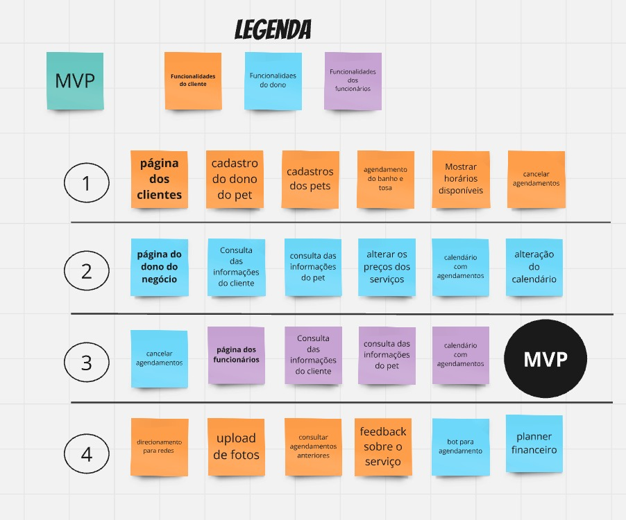

# Concepção

A fase de Concepção do projeto foi fundamental para estabelecer a base e os direcionamentos necessários para o desenvolvimento contínuo. Nessa fase, foram realizados os seguintes marcos importantes:

## Planejamento do Projeto
A equipe estabeleceu os objetivos, cronograma e recursos necessários para o desenvolvimento do projeto. A definição das etapas e marcos foi fundamental para garantir um alinhamento contínuo durante todo o ciclo de vida do projeto.

## Definição do Escopo
O escopo do projeto foi detalhadamente definido, incluindo as funcionalidades principais, as necessidades do cliente e os resultados esperados. Isso ajudou a garantir que o time tivesse clareza sobre as entregas e a visão do produto.

## Decisão dos Cargos
Atribuição dos papéis e responsabilidades dentro da equipe, garantindo a organização e fluidez do processo de desenvolvimento, com a definição dos membros chave para as funções: 

- Gerente de Projeto: Manoela
- Desenvolvedor FrontEnd: Alexandre, com participação da Manoela
- Desenvolvedor BackEnd: Enrico, com participação do Kaio e Pedro Henrique
- Desenvolvedor CI/CD / Testes: Kaio, com participação do Gustavo
- Analista de Requisitos: Pedro Henrique, com a participação de toda a equipe.

## Organização da Documentação
A documentação do projeto foi organizada de forma estruturada, incluindo todos os arquivos e artefatos necessários. Isso facilitou o acompanhamento do progresso do projeto.

## Capacitações
Realização de sessões de capacitação para garantir que todos os membros da equipe estivessem atualizados e capacitados nas tecnologias, ferramentas e metodologias que seriam utilizadas durante o projeto.

## Definição do MVP
O MVP foi definido, contendo as funcionalidades essenciais necessárias para que o produto fosse lançado e pudesse ser utilizado pelos primeiros usuários. Maior detalhamento pode ser encontrado na Visão de Produto e Projeto, na aba Backlog do Produto.

Autores: [Alexandre Júnior](https://github.com/AlexandreLJr), [Gustavo Haubert](https://github.com/GustavoHaubert), [Manoela Garcia](https://github.com/manu-sgc)

## Definição do DoR e DoD
O DoR foi estabelecido, garantindo que cada item do backlog estivesse claramente definido, sem ambiguidades, e pronto para ser trabalhado pela equipe, com todos os critérios de aceitação e requisitos alinhados.
O DoD foi estabelecido para garantir que as funcionalidades entregues estivessem completas e atendendo a todos os critérios de qualidade acordados, como testes unitários, integração e validação com os stakeholders.
Maior detalhamento de ambos pode ser encontrado na Visão de Produto e Projeto, na aba DoR e DoD.

## Declaração de Requisitos Funcionais e Não Funcionais
Foram definidos os requisitos funcionais e não funcionais, abordando tanto as funcionalidades do sistema quanto as qualidades que ele deve possuir para garantir um produto de alta qualidade e que atenda às necessidades dos usuários. Maior detalhamento pode ser encontrado na Visão de Produto e Projeto, na aba Requisitos de Software.

## User Story
User Stories foram criadas para representar as funcionalidades do sistema de forma clara e objetiva, ajudando a equipe a entender as necessidades do cliente. A priorização e maior detalhamento pode ser encontrado na Visão de Produto e Projeto, na aba Backlog do Produto.

**US01** - Como cliente, quero me cadastrar no sistema para poder agendar serviços para meus pets.

**US02** - Como cliente, quero cadastrar meus pets com informações como nome, idade e raça, para facilitar a escolha dos serviços mais adequados.

**US03** - Como cliente, quero agendar serviços de banho e tosa para meus pets, especificando detalhes como o tipo de tosa desejada, para garantir que recebam os cuidados necessários.

**US04** - Como cliente, quero visualizar os horários disponíveis para agendamentos, para escolher o momento mais conveniente para mim e para meus pets.

**US05** - Como cliente, quero cancelar ou reagendar serviços com antecedência, caso surjam imprevistos, para evitar transtornos.

**US06** - Como cliente, quero consultar o histórico dos serviços realizados para meus pets, para acompanhar os cuidados prestados e os custos envolvidos.

**US07** - Como cliente, quero acessar o Instagram do pet shop pelo sistema, para acompanhar novidades e promoções.

**US08** - Como cliente, quero enviar fotos do meu pet ao sistema, para usar como referência em pedidos de tosa personalizada.

**US09** - Como cliente, quero avaliar os serviços prestados com uma nota e comentários, para ajudar a melhorar a qualidade do atendimento.

**US10** - Como administrador, quero acessar os dados cadastrais dos clientes, para entrar em contato com eles e atender melhor suas demandas.

**US11** - Como administrador, quero visualizar informações detalhadas sobre os pets dos clientes, para oferecer um atendimento de qualidade.

**US12** - Como administrador, quero ajustar os preços dos serviços sempre que necessário, para acompanhar custos e promoções.

**US13** - Como administrador, quero acessar um calendário com todos os agendamentos organizados por data e horário, para gerenciar melhor os atendimentos.

**US14** - Como administrador, quero mover ou reagendar horários no calendário, para acomodar ajustes necessários nos atendimentos.

**US15** - Como administrador, quero cancelar agendamentos quando preciso, notificando os clientes de forma clara e imediata.

**US16** - Como administrador, quero acessar relatórios financeiros detalhados, para entender melhor os lucros e despesas do pet shop.

**US17** - Como administrador, quero visualizar e analisar os feedbacks fornecidos pelos clientes, para identificar melhorias nos serviços oferecidos.

**US18** - Como colaborador, quero acessar os dados cadastrais dos clientes, incluindo informações de contato, para facilitar a comunicação direta quando necessário.

**US19** - Como colaborador, quero visualizar as informações dos pets cadastrados, como nome, idade e raça, para prestar os serviços com mais eficiência e personalização.

**US20** - Como colaborador, quero acessar o calendário com todos os agendamentos organizados por horário e data, para gerenciar melhor o fluxo de trabalho e atender os clientes conforme programado.

## Regras de Negócio
As regras de negócio foram estabelecidas, descrevendo as condições, processos e lógicas essenciais que o sistema deve seguir para garantir que os objetivos de negócio sejam atendidos corretamente.

*regras de negócio*