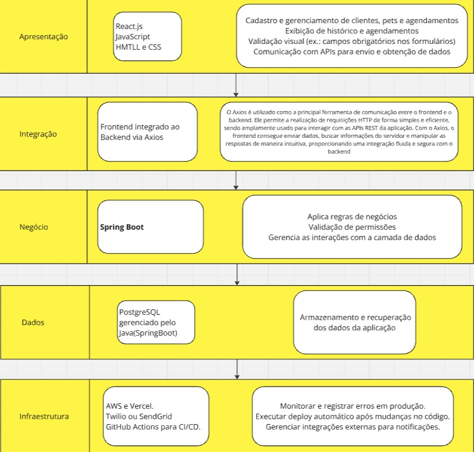

# Elaboração
Na fase de Elaboração, a equipe focou em desenvolver as funcionalidades e validar a arquitetura, enquanto continuava a capacitação da equipe e a análise de riscos para garantir a entrega de um produto de alta qualidade. Os marcos cumpridos nessa fase foram:

## Capacitações
Capacitações contínuas foram realizadas com foco nas tecnologias utilizadas no projeto, garantindo que a equipe estivesse atualizada e equipada para lidar com as necessidades de desenvolvimento, como o uso do Spring Boot, Java, e outras ferramentas necessárias para o backend e frontend.

## Prototipagem
Protótipos interativos foram desenvolvidos no **Figma**, permitindo que a equipe visualizasse e testasse o fluxo de navegação do sistema e a experiência do usuário antes da implementação. Isso facilitou a comunicação com o cliente, ajudando a validar o design e as funcionalidades propostas.

Autores: [Alexandre Júnior](https://github.com/AlexandreLJr), [Manoela Garcia](https://github.com/manu-sgc)

[Link do figma](https://www.figma.com/design/35bsz8P6wMWnZAo6fzlmDj/Prot%C3%B3tipo---pet-shop-guar%C3%A1?node-id=0-1&t=WOYEH2ExE34RqevI-1)

## Análise de Riscos
A análise de riscos foi realizada para identificar possíveis obstáculos no desenvolvimento, como desafios técnicos, limitações de recursos, e riscos de mercado. A equipe definiu estratégias de mitigação para lidar com os riscos identificados, minimizando a chance de imprevistos durante as fases seguintes do desenvolvimento.

**1. Riscos Técnicos**

| **Risco**                             | **Probabilidade** | **Impacto**  | **Mitigação**                                  |
|---------------------------------------|-------------------|--------------|------------------------------------------------|
| Falhas na integração entre o sistema de agendamento e o backend | Média             | Alta         | Realizar testes contínuos durante o desenvolvimento e usar ferramentas confiáveis para integração. |
| Lentidão no sistema devido ao volume de agendamentos | Baixa             | Média        | Monitorar desempenho e otimizar consultas ao banco de dados. |
| Dificuldades no acesso ao sistema por dispositivos móveis | Média             | Alta         | Implementar design responsivo e realizar testes em diferentes dispositivos. |
| Erros no cálculo de receitas mensais | Alta              | Alta         | Validar o cálculo financeiro com casos de teste e revisão pelo cliente. |

**2. Riscos Humanos**

| **Risco**                             | **Probabilidade** | **Impacto**  | **Mitigação**                                  |
|---------------------------------------|-------------------|--------------|------------------------------------------------|
| Falta de engajamento do cliente no acompanhamento do projeto | Média             | Alta         | Agendar reuniões e manter comunicação clara sobre o progresso e decisões importantes. |
| Falta de habilidade técnica em alguma área crítica (ex.: backend ou design) | Média             | Alta         | Fazer treinamentos rápidos e capacitações. |

**3. Riscos de Requisitos**

| **Risco**                             | **Probabilidade** | **Impacto**  | **Mitigação**                                  |
|---------------------------------------|-------------------|--------------|------------------------------------------------|
| Alteração nos requisitos após o início do desenvolvimento | Média              | Alta         | Usar ciclos curtos de desenvolvimento (ex.: Sprints) e validar funcionalidades com o cliente. |
| Requisitos incompletos ou mal definidos | Média             | Alta         | Realizar sessões detalhadas de levantamento e revisão dos requisitos. |

**4. Riscos de Cronograma**

| **Risco**                             | **Probabilidade** | **Impacto**  | **Mitigação**                                  |
|---------------------------------------|-------------------|--------------|------------------------------------------------|
| Atraso na entrega do MVP | Média             | Alta         | Estabelecer prazos realistas e priorizar funcionalidades essenciais para o MVP. |
| Sobrecarga de tarefas na equipe | Alta              | Média        | Dividir as tarefas igualmente e evitar escopo excessivo. |

**5. Riscos de Negócio**

| **Risco**                             | **Probabilidade** | **Impacto**  | **Mitigação**                                  |
|---------------------------------------|-------------------|--------------|------------------------------------------------|
| Falta de aceitação do sistema pelos usuários (dono e clientes do pet shop) | Média             | Alta         | Incluir o cliente nas decisões de design e realizar testes com usuários finais antes do lançamento. |
| O sistema não atender totalmente às expectativas do cliente | Média             | Alta         | Recolher feedback e ajustar o escopo quando necessário. |

**Plano de Monitoramento de Riscos**

1. **Periodicidade**: Revisar os riscos a cada Sprint ou semanalmente.
2. **Indicadores**:  

    - Taxa de erros no sistema durante os testes.  
    - Adesão do cliente às reuniões.  
    - Progresso das tarefas no cronograma.

## Arquitetura

O projeto adota uma arquitetura em camadas, com o frontend em React.js, o backend em Spring Boot com PostgreSQL e a comunicação entre eles feita por meio de uma API RESTful.  Essa estrutura proporciona maior organização, manutenibilidade e escalabilidade.

Autores: [Pedro Henrique Fernandino](https://github.com/PedroHenrique061),  [Kaio Enzo Salgado](https://github.com/kaioenzo), [Enrico  Zoratto](https://github.com/sidts)

**Frontend (React.js - Camada de Apresentação):**

A camada de apresentação, construída com React.js, é responsável por interagir diretamente com o usuário.  Ela lida com a interface, exibindo informações e capturando as ações do usuário.  O React.js, com sua estrutura baseada em componentes, facilita a criação de interfaces dinâmicas e reutilizáveis.

**Backend (Spring Boot com PostgreSQL - Camadas de Negócio e Dados):**

O backend é dividido em duas camadas principais:

* **Camada de Negócio (Spring Boot):**  Esta camada contém a lógica de negócios da aplicação, processando as requisições do frontend, aplicando regras de negócio e gerenciando as interações com a camada de dados.

* **Camada de Dados (PostgreSQL):**  Responsável pelo armazenamento e recuperação dos dados da aplicação. O PostgreSQL, um sistema de gerenciamento de banco de dados relacional. A camada de negócio interage com a camada de dados por meio de abstrações, permitindo que o banco de dados seja alterado sem impactar a lógica de negócios.

**Comunicação (Axios - Camada de Integração):**

O Axios é utilizado como a principal ferramenta de comunicação entre o frontend e o backend. Ele permite a realização de requisições HTTP de forma simples e eficiente, sendo amplamente usado para interagir com as APIs REST da aplicação. Com o Axios, o frontend consegue enviar dados, buscar informações do servidor e manipular as respostas de maneira intuitiva, proporcionando uma integração fluida e segura com o backend.

**Infraestrutura(AWS, Vercel, GitHub Actions):**

O backend e o banco de dados é hospedado na AWS (Amazon Web Services), enquanto o frontend é hospedado na Vercel. A integração contínua e a entrega contínua (CI/CD) são realizadas por meio do GitHub Actions.

## Histórico de Revisão - Arquitetura

| Data       | Versão | Descrição                                             | Autor      |
|------------|--------|-------------------------------------------------------|------------|
| 29/10/2024 | 1.0    | Criação do documento | Kaio Enzo    |
