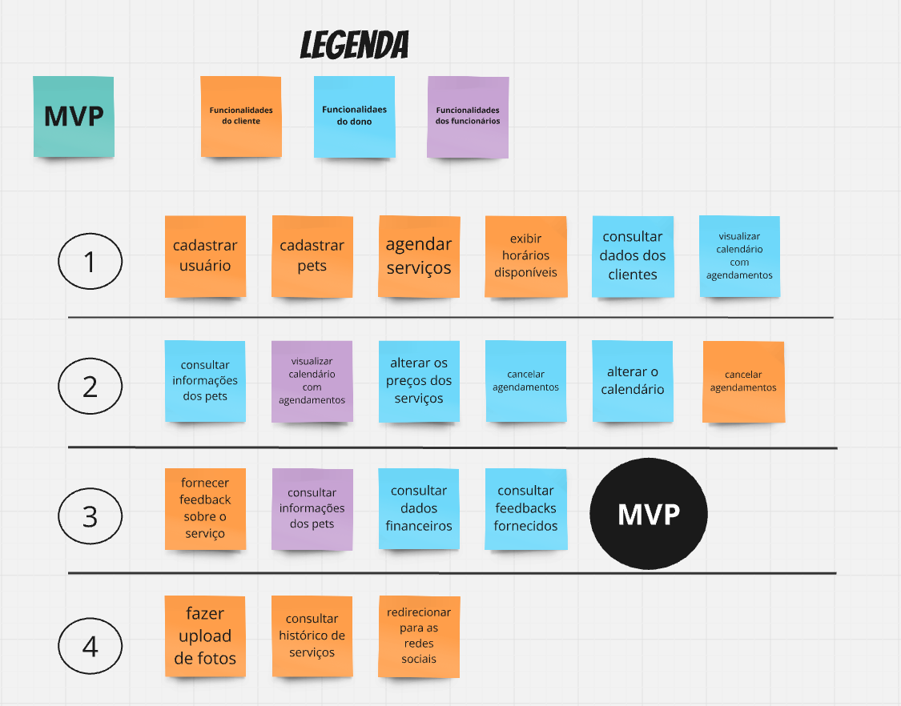

# Backlog do Produto
É importante ressaltar que todas as histórias de usuário apresentadas a seguir foram elaboradas com base na lista de requisitos funcionais descritos anteriormente neste documento. Trata-se de uma lista inicial, sujeita a ajustes ao longo do desenvolvimento do produto da Pet Shop Guará, conforme necessário.

## Backlog Geral

### Cadastro
**US01** - Como cliente, quero me cadastrar no sistema para poder agendar serviços para meus pets.

**US02** - Como cliente, quero cadastrar meus pets com informações como nome, idade e raça, para facilitar a escolha dos serviços mais adequados.

### Agendamento de Serviços
**US03** - Como cliente, quero agendar serviços de banho e tosa para meus pets, especificando detalhes como o tipo de tosa desejada, para garantir que recebam os cuidados necessários.

**US04** - Como cliente, quero visualizar os horários disponíveis para agendamentos, para escolher o momento mais conveniente para mim e para meus pets.

**US05** - Como cliente, quero cancelar ou reagendar serviços com antecedência, caso surjam imprevistos, para evitar transtornos.

**US06** - Como cliente, quero consultar o histórico dos serviços realizados para meus pets, para acompanhar os cuidados prestados e os custos envolvidos.

### Redirecionamento
**US07** - Como cliente, quero acessar o Instagram do pet shop pelo sistema, para acompanhar novidades e promoções.

### Upload de Fotos
**US08** - Como cliente, quero enviar fotos do meu pet ao sistema, para usar como referência em pedidos de tosa personalizada ou para ter salvo em seu cadastro.

### Feedbacks
**US09** - Como cliente, quero avaliar os serviços prestados com uma nota e comentários, para ajudar a melhorar a qualidade do atendimento.

**US10** - Como administrador, quero visualizar e analisar as avaliações fornecidas pelos clientes, para identificar melhorias nos serviços oferecidos.

### Gestão de Clientes e Pets
**US11** - Como administrador, quero acessar os dados cadastrais dos clientes, para entrar em contato com eles e atender melhor suas demandas.

**US12** - Como administrador, quero visualizar informações detalhadas sobre os pets dos clientes, para oferecer um atendimento de qualidade.

**US13** - Como funcionário, quero vizualizar as informações dos pets cadastrados, como nome, idade, raça e nome do dono, para prestar os serviços com mais eficiência.

### Gestão de Preços
**US14** - Como administrador, quero ajustar os preços dos serviços sempre que necessário, para acompanhar custos e promoções.

### Calendário e Agendamentos
**US15** - Como administrador, quero acessar um calendário com todos os agendamentos organizados por data e horário, para gerenciar melhor os atendimentos.

**US16** - Como administrador, quero mover ou reagendar horários no calendário, para acomodar ajustes necessários nos atendimentos.

**US17** - Como administrador, quero cancelar agendamentos quando preciso, notificando os clientes de forma clara e imediata, para liberar a agenda quando não for possível receber o pet.

**US18** - Como funcionário, quero acessar o calendário com os agendamentos do dia organizados por horário, para gerenciar melhor o fluxo de trabalho e atender os clientes conforme programado.

### Relatórios
**US19** - Como administrador, quero acessar relatórios financeiros detalhados, para entender melhor os lucros e despesas do pet shop.

## Priorização do Backlog Geral
Nesta seção, realizamos a priorização dos itens do backlog utilizando a técnica MoSCoW, que organiza as funcionalidades em três categorias principais: 

- **Must have**: Funcionalidades essenciais para o funcionamento do produto, que devem ser entregues sem exceção. 
- **Should have**: Funcionalidades importantes, porém que podem ser implementadas após as funcionalidades essenciais. 
- **Could have**: Funcionalidades desejáveis, que agregam valor, mas não são prioritárias no escopo inicial. 
- **Wont't have**: Funcionalidades que não serão aplicadas, por, inicialmente, não agregarem valor.

A priorização teve como objetivo garantir que o desenvolvimento fosse focado nas funcionalidades mais críticas, alinhando o produto às necessidades do negócio e aos recursos disponíveis. Cada integrante do grupo deu notas de 1 a 4, cada uma tendo sua recṕroca nas categorias do MoSCoW, para cada um dos requisitos. A partir da média dessas notas, foi realizada a priorização.

[Tabela com a priorização do backlog](https://docs.google.com/spreadsheets/d/1aYJmucRqJq6MdoH8feihHwS9ilAsIxsUSNQwmB7tk8o/edit?usp=sharing)

A tabela a seguir apresenta a classificação de cada item do backlog, proporcionando clareza e organização para as próximas etapas do projeto.

| **ID**  | **Descrição**                                                                                  | **Prioridade** |
|---------|------------------------------------------------------------------------------------------------|----------------|
| **US01** | Cadastrar Usuários | Must have      |
| **US02** |Cadstrar Pets  | Must have      |
| **US03** |Agendar Serviço  | Must have      |
| **US04** |Exibir Horários Disponíveis  | Must have      |
| **US05** |Cancelar agendamentos  | Should have    |
| **US06** |Consultar Histórico de Serviços  | Could have      |
| **US07** |Redirecionar para as Redes Sociais  | Could have      |
| **US08** |Fazer Upload de Fotos  | Could have      |
| **US09** |Fornecer Feedback sobre o Serviço  | Should have    |
| **US10** |Consultar os Feedbacks Forncecidos  | Should have     |
| **US11** |Consultar Dados dos Clientes  | Must have    |
| **US12** |Consultar Informações dos Pets  | Must have    |
| **US13** |Consultar Informações dos Pets por Parte dos Funcionários  | Should have     |
| **US14** |Alterar os Preços dos Serviços  | Should have    |
| **US15** |Vizualizar Calendário com Agendamentos  | Must have     |
| **US16** |Alterar o Calendário  | Should have     |
| **US17** |Cancelar Agendamentos  | Should have     |
| **US18** |Vizualizar Calendário com Agendamentos do Dia por Parte dos Funcionários  | Must have     |
| **US19** |Consultar Dados Financeiro  | Should have     |

## MVP
O Produto Mínimo Viável (MVP) é uma versão do produto que inclui as funcionalidades essenciais e prioritárias, selecionadas por meio da técnica MoSCoW, para atender às necessidades principais do cliente, permitindo o lançamento inicial do sistema com as funcionalidades mais críticas.

As funcionalidades escolhidas para o MVP são:

1. **Cadastrar Usuários**  

2. **Cadastrar Pets**  

3. **Agendar Serviços**  

4. **Exibir Horários Disponíveis**  

5. **Consultar Dados dos Clientes**

6. **Visualizar Calendário com Agendamentos**  

7. **Consultar Informações dos Pets**

8. **Visualizar Calendário com Agendamentos do Dia por Parte dos Funcionários**

9. **Alterar os Preços dos Serviços**

10. **Cancelar Agendamentos por Parte do Dono**  

11. **Alterar o Calendário**

12. **Cancelar Agendamentos por Parte do Cliente**  

13. **Fornecer Feedback sobre o Serviço**

14. **Consultar Informações dos Pets por Parte dos Funcionários**

15. **Consultar dados financeiros**

16. **Consultar feedbacks fornecidos**

17. **Interface Institiva**

18. **Feedback Visual**

19. **Disponibilidade**

20. **Recuperação de Falhas**

21. **Processamento**

22. **Eficiência**

23. **Compatibilidade**

24. **Linguagem de Programação**

25. **Banco de Dados**

Autores: [Alexandre Júnior](https://github.com/AlexandreLJr), [Gustavo Haubert](https://github.com/GustavoHaubert), [Manoela Garcia](https://github.com/manu-sgc)

Essas funcionalidades são essenciais para a operação inicial do sistema e foram priorizadas para garantir que o produto atenda às necessidades básicas do cliente e colaboradores do pet shop, com o objetivo de facilitar a gestão de serviços e o relacionamento com os clientes.

As funcionalidades que não entraram no MVP, as da classificação *Could Have*, serão feitas após a conculsão do MVP, por não serem críticas para o funcionamento do sistema.