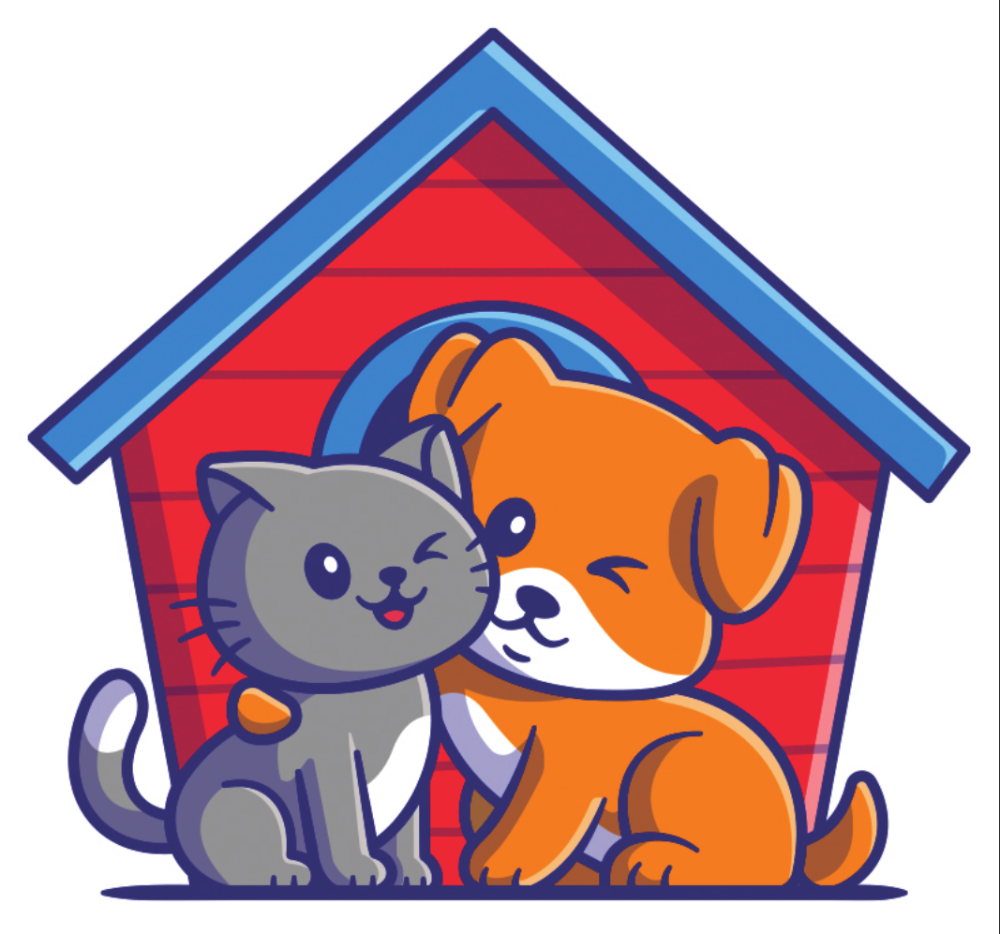

# Pet Shop Guará

  

## Introdução 

 O Projeto Pet Shop Guará é um projeto desenvolvido durante a disciplina de Requisitos de Software durante o semestre 2024.2. A ideia do projeto é desenvolver uma ferramenta web que facilite a organização de um pet shop. Mais informações disponíveis na Visão Geral do Produto

## Equipe 

 | [Alexandre  Júnior](https://github.com/AlexandreLJr) | [Enrico  Zoratto](https://github.com/sidts) | [Gustavo  Haubert](https://github.com/GustavoHaubert) | [Kaio Enzo Salgado](https://github.com/kaioenzo) | [Manoela Garcia ](https://github.com/manu-sgc) | [Pedro Henrique Fernandino](https://github.com/PedroHenrique061) |
| :---: | :---: | :---: | :---: | :---: | :---: |
|  |  |  |  |  |  |
