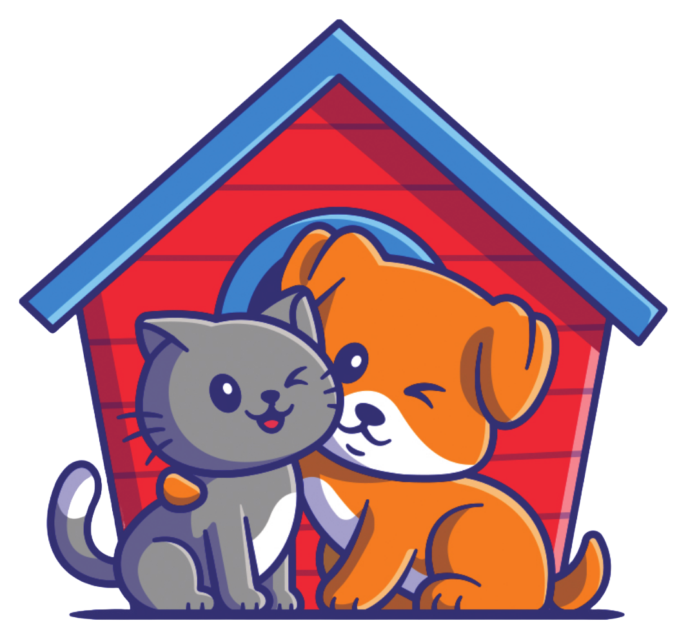
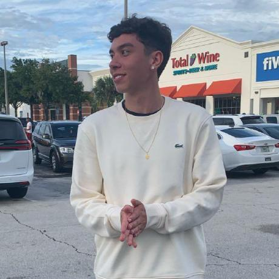
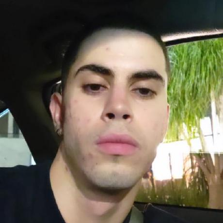
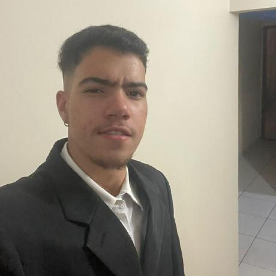

# Pet Shop Guará

  

## Introdução 

 O Projeto Pet Shop Guará é um projeto desenvolvido durante a disciplina de Requisitos de Software durante o semestre 2024.2. A ideia do projeto é desenvolver uma aplicação web que facilite a organização e melhore a eficiência operacional de um pet shop. Mais informações disponíveis na Visão Geral do Produto

## Equipe 

 | [Alexandre  Júnior](https://github.com/AlexandreLJr) | [Enrico  Zoratto](https://github.com/sidts) | [Gustavo  Haubert](https://github.com/GustavoHaubert) | [Kaio Enzo Salgado](https://github.com/kaioenzo) | [Manoela Garcia ](https://github.com/manu-sgc) | [Pedro Henrique Fernandino](https://github.com/PedroHenrique061) |
| :---: | :---: | :---: | :---: | :---: | :---: |
|  |  |  |  |  |  |

## Histórico de Revisão

| Data       | Versão | Descrição                                             | Autor      |
|------------|--------|-------------------------------------------------------|------------|
| 29/10/2024 | 1.0    | Documento inicial com os tópicos para a aprovação do projeto (1 e 2) | Manoela    |
| 31/10/2024 | 1.1    | Atualização de tópicos que faltaram e correção de alguns já existentes |   Grupo       |
| 02/11/2024 | 2.0    | Adição dos tópicos 3 ao 6                             | Manoela    |
| 06/11/2024 | 2.1    | Correção dos feedbacks levantados pelo professor e melhora de alguns dos novos tópicos |    Grupo      |
| 11/11/2024 | 2.2    | Adição de como o OpenUP será realizado ao longo do semestre | Alexandre |
| 20/11/2024 | 2.3    | Alteração do cronograma para corresponder o mvp | Alexandre |
